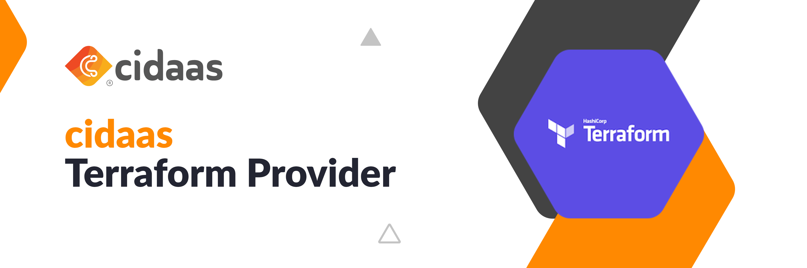

<p align="center">
  
</p>

<p align="center">
  <a href="https://www.terraform.io">
    
  </a>
</p>

<p align="center">
  
</p>

# Terraform Provider for cidaas (v4)

<p align="center">
  <a href="https://registry.terraform.io/providers/Cidaas/cidaas/latest"></a>
  <a href="https://www.terraform.io/downloads.html">= 1.0"/></a>
  <a href="https://go.dev/doc/install">= 1.25"/></a>
  <a href="docs/guides/getting-started.md"></a>
</p>

Manage cidaas **v4 (Trustdesk)** tenants with Terraform: applications, scopes, roles, registration fields, hosted pages, notifications, identity providers, and more.

Registry address: `registry.terraform.io/Cidaas/cidaas`

The Terraform provider for cidaas enables interaction with cidaas instances for CRUD operations on applications, custom providers, registration fields, and many other capabilities. From managing applications to configuring custom providers, it helps you define, provision, and manipulate cidaas resources as infrastructure as code.

<p align="center">
  
</p>

## About cidaas

[cidaas](https://www.cidaas.com) is a fast and secure Cloud Identity & Access Management solution that standardises what's important and simplifies what's complex.

<details open>
<summary><strong>Feature set includes</strong></summary>

- Single Sign On (SSO) based on OAuth 2.0, OpenID Connect, SAML 2.0
- Multi-Factor Authentication with more than 14 authentication methods, including TOTP and FIDO2
- Passwordless Authentication
- Social Login (e.g. Facebook, Google, LinkedIn and more) as well as Enterprise Identity Providers (e.g. SAML or AD)
- Security in Machine-to-Machine (M2M)

</details>

<p align="center">
  
</p>

## Documentation

| Section | Path |
|---------|------|
| Provider overview | [docs/index.md](docs/index.md) |
| Resource reference | [docs/resources/](docs/resources/) |
| Guides | [docs/guides/](docs/guides/) |
| v3 to v4 Migration | [docs/guides/v3-to-v4-migration.md](docs/guides/v3-to-v4-migration.md) |
| Examples (HCL) | [examples/](examples/) |
| Changelog | [CHANGELOG.md](CHANGELOG.md) |
| Contributing (docs workflow) | [CONTRIBUTING.md](CONTRIBUTING.md) |

<details open>
<summary><strong>Guides</strong> — jump in</summary>

- [Getting started](docs/guides/getting-started.md)
- [Authentication](docs/guides/authentication.md)
- [Provider configuration](docs/guides/version-targeting.md)
- [Resource dependency order](docs/guides/resource-dependencies.md)
- [v3 to v4 Migration](docs/guides/v3-to-v4-migration.md)

</details>

Attribute schemas and Example Usage for each resource are generated into `docs/resources/` — do not treat this README as a substitute for those pages.

<p align="center">
  
</p>

## Requirements

<details open>
<summary><strong>What you need</strong></summary>

- Ensure [Terraform](https://www.terraform.io/downloads.html) (>= 1.0) is installed on your local machine. Installation instructions for different operating systems are on the Terraform downloads page.
- Go >= 1.25 (for building from source)
- A cidaas **v4** tenant and a non-interactive OAuth client (`client_id` / `client_secret`) with scopes for the resources you manage

</details>

<p align="center">
  
</p>

## Quick start

<details open>
<summary><strong>Credentials</strong> (required)</summary>

```bash
export TERRAFORM_PROVIDER_CIDAAS_CLIENT_ID="your-client-id"
export TERRAFORM_PROVIDER_CIDAAS_CLIENT_SECRET="your-client-secret"
```

</details>

<details open>
<summary><strong>Target version</strong> (required)</summary>

Set via HCL or environment. Precedence: `cidaas_version` in the provider block → `TERRAFORM_PROVIDER_CIDAAS_VERSION` → `CIDAAS_VERSION`.

```hcl
terraform {
  required_providers {
    cidaas = {
      source  = "Cidaas/cidaas"
      version = ">= 4.0.0-alpha.1"
    }
  }
}

provider "cidaas" {
  base_url       = "https://your-tenant.cidaas.eu"
  cidaas_version = "4.x"
}
```

Details: [Authentication](docs/guides/authentication.md) · [Provider schema](docs/index.md)

</details>

<p align="center">
  
</p>

## Resources

Every registered resource is listed below. **Docs** = Registry page; **Example** = sample HCL (`resource.tf`).

<details open>
<summary><strong>Cidaas v4 Resources</strong></summary>

| Resource | API / service | Description | Docs | Example |
|----------|---------------|-------------|------|---------|
| [`cidaas_app_configuration`](docs/resources/app_configuration.md) | `/app-srv/apps` | Application configuration (Trustdesk app model) | [docs](docs/resources/app_configuration.md) | [example](examples/resources/cidaas_app_configuration/resource.tf) |
| [`cidaas_hosted_page`](docs/resources/hosted_page.md) | `/hostedpages-srv/hpgroup` | Unified hosted page group & pages resource (supports inline theme, translations, layout) | [docs](docs/resources/hosted_page.md) | [example](examples/resources/cidaas_hosted_page/resource.tf) |
| [`cidaas_hosted_page_layout`](docs/resources/hosted_page_layout.md) | `/hostedpages-srv/hosted-page-layouts` | Hosted page layouts | [docs](docs/resources/hosted_page_layout.md) | [example](examples/resources/cidaas_hosted_page_layout/resource.tf) |
| [`cidaas_theme`](docs/resources/theme.md) | `/hostedpages-srv/themes` | Custom CSS themes | [docs](docs/resources/theme.md) | [example](examples/resources/cidaas_theme/resource.tf) |
| [`cidaas_translations`](docs/resources/translations.md) | `/hostedpages-srv/translations` | Hosted page locale strings | [docs](docs/resources/translations.md) | [example](examples/resources/cidaas_translations/resource.tf) |
| [`cidaas_user_setup`](docs/resources/user_setup.md) | `/user-srv/usersetup` | Tenant user registration setup | [docs](docs/resources/user_setup.md) | [example](examples/resources/cidaas_user_setup/resource.tf) |
| [`cidaas_suggest_verification_method`](docs/resources/suggest_verification_method.md) | `/verification-actions-srv/suggest-verification-configs` | Suggested verification methods | [docs](docs/resources/suggest_verification_method.md) | [example](examples/resources/cidaas_suggest_verification_method/resource.tf) |
| [`cidaas_verification_options`](docs/resources/verification_options.md) | `/verification-actions-srv/verification-options` | Verification options | [docs](docs/resources/verification_options.md) | [example](examples/resources/cidaas_verification_options/resource.tf) |
| [`cidaas_federation_provider`](docs/resources/federation_provider.md) | `/federation/providers` | Enterprise federation providers | [docs](docs/resources/federation_provider.md) | [example](examples/resources/cidaas_federation_provider/resource.tf) |
| [`cidaas_group_selection`](docs/resources/group_selection.md) | `/groups-srv/selection` | Group login selection | [docs](docs/resources/group_selection.md) | [example](examples/resources/cidaas_group_selection/resource.tf) |
| [`cidaas_group_verification_filter`](docs/resources/group_verification_filter.md) | `/groups-srv/verification-filter` | Group verification filters | [docs](docs/resources/group_verification_filter.md) | [example](examples/resources/cidaas_group_verification_filter/resource.tf) |
| [`cidaas_registration_field`](docs/resources/registration_field.md) | registration-setup-srv | Registration fields & validators | [docs](docs/resources/registration_field.md) | [example](examples/resources/cidaas_registration_field/resource.tf) |
| [`cidaas_role`](docs/resources/role.md) | roles-srv | Tenant roles | [docs](docs/resources/role.md) | [example](examples/resources/cidaas_role/resource.tf) |
| [`cidaas_user_groups`](docs/resources/user_groups.md) | groups-srv | User groups | [docs](docs/resources/user_groups.md) | [example](examples/resources/cidaas_user_groups/resource.tf) |
| [`cidaas_group_type`](docs/resources/group_type.md) | groups-srv | Group types & role modes | [docs](docs/resources/group_type.md) | [example](examples/resources/cidaas_group_type/resource.tf) |
| [`cidaas_scope`](docs/resources/scope.md) | scopes-srv | OAuth scopes | [docs](docs/resources/scope.md) | [example](examples/resources/cidaas_scope/resource.tf) |
| [`cidaas_scope_group`](docs/resources/scope_group.md) | scopes-srv | Scope groups | [docs](docs/resources/scope_group.md) | [example](examples/resources/cidaas_scope_group/resource.tf) |
| [`cidaas_password_policy`](docs/resources/password_policy.md) | password-policy-srv | Password policies | [docs](docs/resources/password_policy.md) | [example](examples/resources/cidaas_password_policy/resource.tf) |
| [`cidaas_security_settings`](docs/resources/security_settings.md) | security-srv | Tenant security settings | [docs](docs/resources/security_settings.md) | [example](examples/resources/cidaas_security_settings/resource.tf) |
| [`cidaas_notifications_template_group`](docs/resources/notifications_template_group.md) | notification-srv | Notification template groups | [docs](docs/resources/notifications_template_group.md) | [example](examples/resources/cidaas_notifications_template_group/resource.tf) |
| [`cidaas_webhook`](docs/resources/webhook.md) | webhook-srv | Webhooks and event subscriptions | [docs](docs/resources/webhook.md) | [example](examples/resources/cidaas_webhook/resource.tf) |

</details>

Identity provider example: [federation](examples/resources/cidaas_federation_provider/resource.tf). On Trustdesk, `owner` defaults to `client` for Admin UI visibility.

<p align="center">
  
</p>

## Local development

<details open>
<summary><strong>Build, test, generate docs</strong></summary>

```bash
make build      # build provider binary
make install    # install into ~/.terraform.d/plugins
make test       # unit tests
make generate   # fmt examples + generate docs/

# Acceptance tests (requires tenant credentials)
CIDAAS_VERSION=4.x TF_ACC=1 BASE_URL=https://... make testacc
```

See [CONTRIBUTING.md](CONTRIBUTING.md) for the documentation workflow.

</details>

<details open>
<summary><strong>Before you push</strong></summary>

Acceptance tests (`acceptance_test` in `.gitlab-ci.yml`) create **real** resources on a cidaas tenant. Run them locally against a **dedicated test tenant**, not production.

</details>

<p align="center">
  
</p>

## CI / CD

<details open>
<summary><strong>GitLab pipeline</strong></summary>

GitLab CI (`.gitlab-ci.yml`):

- `acceptance_test` — `make test-ci` (`CIDAAS_VERSION=4.x`)

</details>

---

## License

See [LICENSE](LICENSE).
